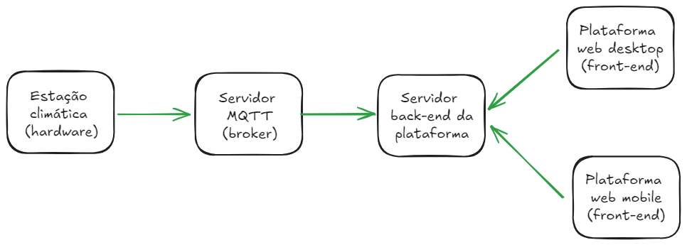
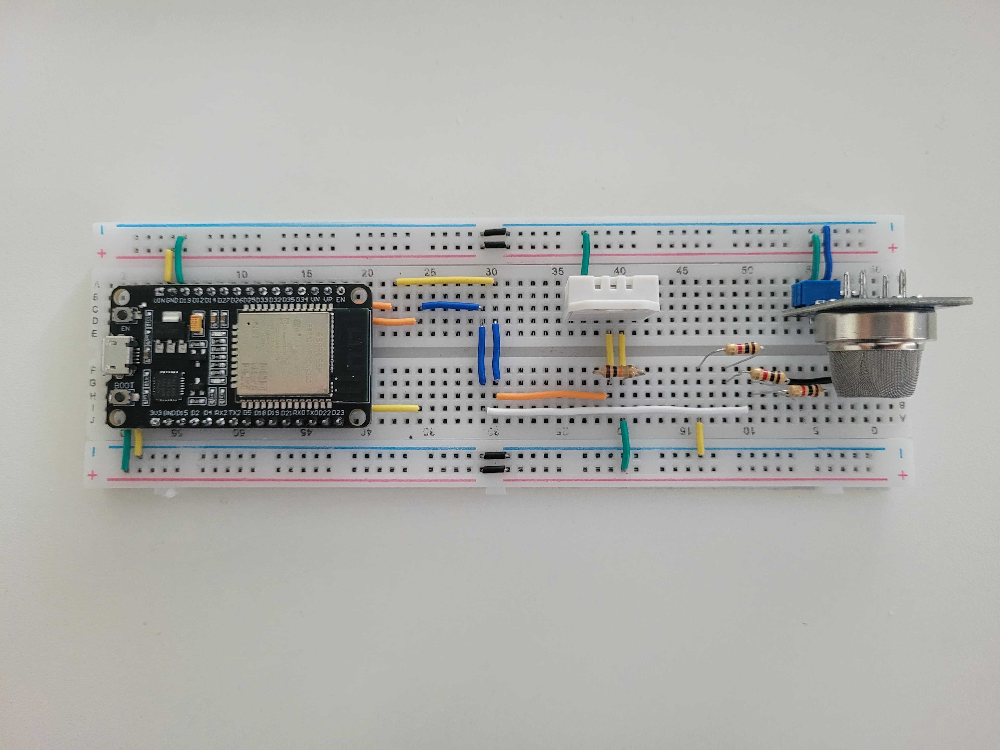
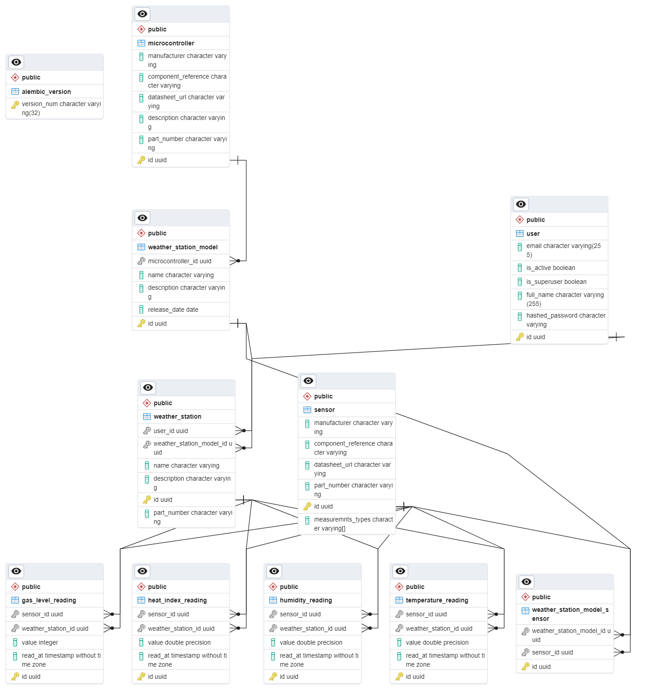

# Estação climática doméstica - Overview

## Introdução

O objetivo deste projeto é desenvolver o protótipo de um produto que seja passível de comercialização e que se relacione com boas práticas ambientais. Tal desenvolvimento contemplará tanto a parte de hardware quando a parte de software do produto.

Nesse sentido, foi escolhido desenvolver uma estação climática doméstica, a qual será capaz de fornecer dados e _insights_ totalmente personalizados. O escopo dessas informações oferecidas pela estação será direcionado, principalmente, para aspectos de saúde, de bem-estar e de segurança.

Inicialmente, os dados medidos pela estação climática doméstica serão: temperatura, umidade do ar, sensação térmica e nível de gases tóxicos. Espera-se, ao final do projeto, ter uma plataforma web que não só exiba esses dados como também, por meio de ferramentas de inteligência artifical, forneça _insights_ sobre eles. Como exemplo desses _insights_, pode-se citar sugestões de práticas que promovam o bem estar respiratório em cenários de ar seco, alerta de incêndios em cenários de elevado nível de gases tóxicos, entre outros.

## Arquitetura do produto

## Hardware do produto

Componentes:

- Microcontrolador ESP-32
- Sensor de temperatura e umidade (DHT22)
- Sensor de gases tóxicos (MQ-135)

## Modelagem dos dados do produto

